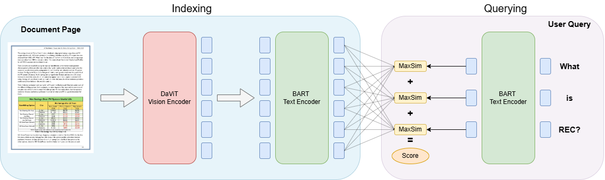

# ColFlor: Towards BERT-Size Vision-Language Document Retrieval Models
---

[[Model card]](https://huggingface.co/ahmed-masry/ColFlor)
[[Demo]](https://huggingface.co/spaces/ahmed-masry/ColFlor-Demo)
[[Blog Post]](https://huggingface.co/blog/ahmed-masry/colflor)


## BlogPost

This repository contains the code used for training the ColFlor model described in the [*ColFlor: Towards BERT-Size Vision-Language Document Retrieval Models*](https://huggingface.co/blog/ahmed-masry/colflor) blogpost.

## Introduction

In June 2024, [ColPali](https://arxiv.org/abs/2407.01449) was introduced as an OCR-free document retrieval model, built over [PaliGemma](https://arxiv.org/abs/2407.07726), shifting the paradigm of PDF document retrieval by directly processing images instead of using error-prone and resource-heavy OCR pipelines. However, with three billion parameters, ColPali might be computationally expensive, especially for large document databases. In contrast, text retrieval models like [ColBERT](https://arxiv.org/abs/2004.12832) are more efficient with just a few hundred million parameters, but they require error-prone and expensive OCR pipelines to. To bridge this gap, we introduce ColFlor, an OCR-free visual document retrieval model with only 174 million parameters.

For more information, please refer to our blogpost: [ColFlor Blogpost](https://huggingface.co/blog/ahmed-masry/colflor/)



## Usage

### Quick start

First, clone this github repo and install dependencies using the following command: 

```bash
pip install -e .
```

Afetr that, you can run the code below for inference. 

```python
import torch
from PIL import Image

from colpali_engine.models import ColFlor, ColFlorProcessor

model_name = "ahmed-masry/ColFlor"

model = ColFlor.from_pretrained(
    model_name,
    device_map="cuda", 
).eval()

processor = ColPaliProcessor.from_pretrained(model_name)

# Your inputs
images = [
    Image.new("RGB", (32, 32), color="white"),
    Image.new("RGB", (16, 16), color="black"),
]
queries = [
    "Is attention really all you need?",
    "Are Benjamin, Antoine, Merve, and Jo best friends?",
]

# Process the inputs
batch_images = processor.process_images(images).to(model.device)
batch_queries = processor.process_queries(queries).to(model.device)

# Forward pass
with torch.no_grad():
    image_embeddings = model(**batch_images)
    query_embeddings = model(**batch_queries)

scores = processor.score_multi_vector(query_embeddings, image_embeddings)

```

### Benchmarking

To reproduce the results reported in the blogpost, you can simple run the following colab notebook on a free T4 gpu! 
[[Colab Evaluation Notebook]](https://colab.research.google.com/drive/1fvLP5WLKssg9yEtkwVdG5yxMBGhrcjGZ?usp=sharing )

The notebook mainly utilizes the evaluation codes from this github repo: [[Vidore Benchmark colflor]](https://github.com/AhmedMasryKU/vidore-benchmark-colflor)

### Training

We prepared the following colab notebook for training the model on a free T4 GPU! 
[Colab Training Notebook](https://colab.research.google.com/drive/10jj_Hd9JjBNnF-fcezbotrn7XEq5DSX2?usp=sharing)
Make sure to modify the yaml file based on your dataset and training setup!

## Acknowledgement
This work was carried out at the Intelligent Visualization Lab at York University in Canada. It was supported by the Natural Sciences Engineering Research Council (NSERC) of Canada and Canada Foundation for Innovation (CFI). Additionally, it received support through a GCP credits award from Google's PaliGemma Academic. 
This readme file (and github repo) was adapted from the ColPali original github repo (https://github.com/illuin-tech/colpali)

## Contact
If you have any questions about this work, feel free to reach out to Ahmed Masry at masry20@yorku.ca or ahmed.elmasry24653@gmail.com

## Citation
If you plan to use ColFlor in your research, please consider citing us as follows:
```latex
@misc{masry2024colflor,
    title={ColFlor: BERT-Size Vision-Language Document Retrieval Models},
    url={https://huggingface.co/blog/ahmed-masry/colflor},
    author={Masry, Ahmed},
    month={October},
    year={2024}
}
```
